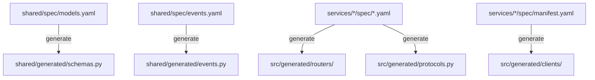

# Architecture & Design

This document describes how the principles in `MANIFESTO.md` are implemented technically.

## The "Spec-First" Flow

The heart of the framework is the specification system. Specs define the data model, API surface, and service dependencies.



### Spec Locations

| Spec | Location | Generates |
|------|----------|-----------|
| Models | `shared/spec/models.yaml` | Pydantic schemas |
| Events | `shared/spec/events.yaml` | FastStream pub/sub |
| Domain | `services/<service>/spec/<domain>.yaml` | Routers, protocols, controllers |
| Manifest | `services/<service>/spec/manifest.yaml` | Typed REST clients |

## Domain Specification Format

Each domain spec defines transport-agnostic operations:

```yaml
# services/backend/spec/users.yaml
domain: users
config:
  rest:
    prefix: "/users"
    tags: ["users"]

operations:
  create_user:
    input: UserCreate
    output: UserRead
    rest:
      method: POST
      path: ""
      status: 201

  get_user:
    output: UserRead
    params:
      - name: user_id
        type: int
    rest:
      method: GET
      path: "/{user_id}"
```

Key concepts:
- **Operations** are transport-agnostic (can have both REST and Events transports)
- **Models** are referenced by name (defined in `shared/spec/models.yaml`)
- **Params** define path/query parameters

## Client Generation (Service Dependencies)

Consumer services declare dependencies via `manifest.yaml`:

```yaml
# services/tg_bot/spec/manifest.yaml
consumes:
  - service: backend
    domain: users
    operations:
      - create_user
      - get_user
```

This generates a typed HTTP client:

```python
# services/tg_bot/src/generated/clients/backend.py
class BackendClient:
    async def create_user(self, payload: UserCreate) -> UserRead: ...
    async def get_user(self, user_id: int) -> UserRead: ...
```

Usage:
```python
async with BackendClient() as client:
    user = await client.create_user(UserCreate(telegram_id=123))
```

## Service Modules ("Batteries")

The project is a collection of modular services defined in `services.yml`.

- **Definition:** A service is an entry in `services.yml` with a `name`, `type`, and `description`.
- **Scaffolding:** The `make sync-services` command ensures that for every entry in `services.yml`, a corresponding directory exists in `services/` with the correct boilerplate.
- **Isolation:** Each service is its own Docker container. They communicate only via defined APIs or shared infrastructure (DB, Queue).
- **Types:**
    - `python-fastapi`: HTTP API service using FastAPI with uvicorn (exposes port 8000).
    - `python-faststream`: Event-driven worker using FastStream (no HTTP, consumes from message broker).
    - `node`: Node.js service (exposes port 4321).
    - `default`: Generic container placeholder.
- **Compose Options:** Services can specify `depends_on` and `profiles` in `services.yml` to customize Docker Compose behavior.

## Containerization Strategy

**Rule:** Nothing runs on the host machine except `docker`, `make`, and `git`.

- **Tooling Container:** We use a dedicated `tooling` service in `docker-compose` to run administrative tasks (migrations, linting, scaffolding). This ensures all developers and agents use the exact same versions of tools.
- **Service Containers:** Each service has its own `Dockerfile` generated from a template.

## Directory Structure

- `infra/`: Docker Compose files and infrastructure config.
- `services/`: Source code for individual microservices.
  - `<service>/spec/`: Domain and manifest specs for this service
  - `<service>/src/generated/`: Auto-generated routers, protocols, clients
  - `<service>/src/controllers/`: Business logic (manual)
- `shared/`:
    - `spec/`: YAML specifications (models, events)
    - `shared/generated/`: Auto-generated schemas and events
- `.framework/`: Framework runtime (hidden, auto-updated via `copier update`)
  - Contains code generators and templates
  - Used by `make generate-from-spec` to regenerate code from specs
  - **Do not edit**: Changes will be overwritten on framework updates

## Framework Development

This repository structure is for **generated products**. Framework development happens in the [service-template](https://github.com/your-org/service-template) repository:

- `framework/`: Source code for generators and validators
  - `generators/`: Python generators for each artifact type
  - `templates/codegen/`: Jinja2 templates for generated code
- `tests/`: Framework tests (unit, integration, copier)
- `docs/`: Framework internal documentation
