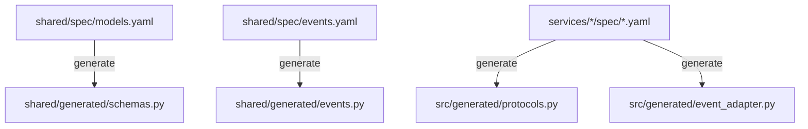

# Architecture & Design

This document describes how the principles in `MANIFESTO.md` are implemented technically.

## The "Spec-First" Flow

The heart of the framework is the specification system. Specs define the data model, API surface, and service dependencies.



### Spec Locations

| Spec | Location | Generates |
|------|----------|-----------|
| Models | `shared/spec/models.yaml` | Pydantic schemas |
| Events | `shared/spec/events.yaml` | FastStream pub/sub |
| Domain | `services/<service>/spec/<domain>.yaml` | Protocols, controllers, event adapters |

**Note**: Specs act as contracts between services. For standalone modules (e.g. `tg_bot` without `backend`), specs are optional and their validation is gracefully skipped.

## Domain Specification Format

Each domain spec defines transport-agnostic operations:

```yaml
# services/backend/spec/users.yaml
domain: users
config:
  rest:
    prefix: "/users"
    tags: ["users"]

operations:
  create_user:
    input: UserCreate
    output: UserRead
    rest:
      method: POST
      path: ""
      status: 201

  get_user:
    output: UserRead
    params:
      - name: user_id
        type: int
    rest:
      method: GET
      path: "/{user_id}"
```

Key concepts:
- **Operations** are transport-agnostic (can have both REST and Events transports)
- **Models** are referenced by name (defined in `shared/spec/models.yaml`)
- **Params** define path/query parameters

## Unified Handlers Architecture

Operations can be exposed via multiple transports (REST, Events, or both) while sharing a single controller implementation.

### Transport Types

| Type | Transport | Use Case |
|------|-----------|----------|
| **Query** | REST only | Synchronous reads, no side effects |
| **Command** | REST + Events | REST returns result, event published async |
| **Background** | Events only | No HTTP endpoint, async processing |

### One Controller, Multiple Adapters

```
┌─────────────────────────────────────────────────┐
│            UsersController (business logic)     │
│  ┌──────────────────────────────────────────┐   │
│  │ get_user(user_id) → UserRead             │   │
│  │ create_user(payload) → UserRead          │   │
│  │ process_import(batch) → ImportResult     │   │
│  └──────────────────────────────────────────┘   │
└───────────────────────────────────────────────────┘
                    ▲                 ▲
                    │                 │
        ┌───────────┴───────┐   ┌─────┴─────────────┐
        │   REST Adapter    │   │   Events Adapter  │
        │   (generated)     │   │   (generated)     │
        └───────────────────┘   └───────────────────┘
```

### Event Configuration

Operations can include `events:` section for pub/sub behavior:

```yaml
operations:
  create_user:
    input: UserCreate
    output: UserRead
    rest:
      method: POST
      status: 201
    events:
      publish_on_success: user.created  # Publish after successful creation

  process_import:
    input: ImportBatch
    output: ImportResult
    events:
      subscribe: import.requested        # Subscribe to incoming events
      publish_on_success: import.completed
      publish_on_error: import.failed    # Error handling channel
```

### Generated Event Adapter

For services with `events.subscribe` operations, the framework generates `event_adapter.py`:

```python
def create_event_adapter(
    broker: RedisBroker,
    get_session: Callable[[], AsyncIterator[AsyncSession]],
    get_imports_controller: Callable[[], ImportsControllerProtocol],
) -> None:
    @broker.subscriber("import.requested")
    async def handle_process_import(event: ImportBatch) -> None:
        async with get_session() as session:
            controller = get_imports_controller()
            try:
                result = await controller.process_import(session, payload=event)
                await broker.publish(result, "import.completed")
            except Exception as e:
                await broker.publish({"error": str(e)}, "import.failed")
                raise
```


## Inter-Service Communication

Inter-service communication should primarily be done via **events** (Redis Streams). Synchronous REST calls between services are considered an anti-pattern in event-driven architecture.

However, if a service (like a standalone `tg_bot`) strictly needs to query another service via HTTP, it should inherit from the shared `ServiceClient` utility which provides retry logic and exponential backoff:

```python
# services/tg_bot/src/client.py
from shared.http_client import ServiceClient
from shared.generated.schemas import UserCreate, UserRead

class BackendClient(ServiceClient):
    async def create_user(self, payload: UserCreate) -> UserRead:
        response = await self._request_with_retry(
            "POST", "/users", json=payload.model_dump()
        )
        return UserRead.model_validate(response.json())
```

Usage follows the context manager pattern:
```python
async with BackendClient(base_url=config.API_BASE_URL) as client:
    user = await client.create_user(payload)
```

## Wiring Layer (Manual Files)

While most code is generated from specs, a few files remain **manual by design**:

### `app/api/router.py` — Router Composition

This is the **wiring layer** where generated routers are composed with dependencies:

```python
# services/backend/src/app/api/router.py
from services.backend.src.generated.registry import create_api_router
from services.backend.src.controllers.users import UsersController

def get_users_controller() -> UsersController:
    return UsersController()

api_router = APIRouter()
api_router.include_router(health.router, tags=["health"])
domain_router = create_api_router(
    get_db=get_async_db,
    get_broker=get_broker,
    get_users_controller=get_users_controller,
)
api_router.include_router(domain_router)
```

**Why manual:**
- Controller instantiation may need custom dependency injection
- Flexibility for middleware, exception handlers, CORS configuration
- Single place to understand "how everything connects"

### `app/api/v1/health.py` — Infrastructure Endpoints

Health checks are **infrastructure**, not domain logic:

```python
@router.get("/health")
async def health() -> dict:
    return {"status": "ok"}
```

**Why manual:**
- Standard across all projects
- May need custom checks (DB, Redis, external APIs)
- Not part of domain spec

> **Note:** The spec compliance linter whitelists these files — `APIRouter` usage is allowed here but forbidden in domain code.


## Data Layer

The Data Layer handles persistence using SQLAlchemy ORM. Unlike Pydantic schemas, ORM models are **manual** — not generated from specs.

### Directory Structure

| Path | Purpose |
|------|---------|
| `src/core/db.py` | Engine, session factory, `ORMBase` with timestamps |
| `src/app/models/*.py` | SQLAlchemy ORM models (manual) |
| `src/app/repositories/*.py` | Repository pattern (recommended) |
| `migrations/` | Alembic migrations |

### ORM Models vs Pydantic Schemas

- **Pydantic schemas** (`shared/generated/schemas.py`) — generated from `models.yaml`
- **ORM models** (`src/app/models/`) — **manual**, not generated

Why separate? ORM models often need:
- Database-specific types (`BigInteger`, `JSONB`, indexes)
- Relationships and foreign keys
- Migration-aware defaults (`server_default`)

**Mapping ORM → Pydantic:**
```python
def _to_schema(user: User) -> UserRead:
    return UserRead.model_validate(user, from_attributes=True)
```

### Transaction Management

`get_async_db()` provides automatic transaction handling:

```python
async def get_async_db() -> AsyncGenerator[AsyncSession, None]:
    db = AsyncSessionLocal()
    try:
        yield db
        await db.commit()   # ✅ Auto-commit on success
    except Exception:
        await db.rollback() # ❌ Auto-rollback on error
        raise
```

> **Important:** Do NOT call `session.commit()` in controllers — it's handled automatically.

### Adding a New Model

1. Create ORM model in `src/app/models/myentity.py`
2. Export in `src/app/models/__init__.py`
3. Generate migration: `make makemigrations name="add_myentity"`
4. Verify migration in `migrations/versions/`
5. Migrations run automatically on service startup

### Repository Pattern (Recommended)

Encapsulate database queries in repository classes:

```python
class UserRepository:
    def __init__(self, session: AsyncSession):
        self.session = session

    async def get(self, user_id: int) -> User | None:
        return await self.session.get(User, user_id)

    async def create(self, payload: UserCreate) -> User:
        user = User(**payload.model_dump())
        self.session.add(user)
        await self.session.flush()
        return user
```

Controllers use repositories via session injection:
```python
async def create_user(self, session: AsyncSession, payload: UserCreate) -> UserRead:
    repo = UserRepository(session)
    user = await repo.create(payload)
    return _to_schema(user)
```

Benefits:
- Testable (mock repositories, not sessions)
- Reusable queries across controllers
- Clear separation of concerns


## Service Modules ("Batteries")

The project is a collection of modular services defined in `services.yml`.

- **Definition:** A service is an entry in `services.yml` with a `name`, `type`, and `description`.
- **Scaffolding:** The `make sync-services` command ensures that for every entry in `services.yml`, a corresponding directory exists in `services/` with the correct boilerplate.
- **Isolation:** Each service is its own Docker container. They communicate only via defined APIs or shared infrastructure (DB, Queue).
- **Types:**
    - `python-fastapi`: HTTP API service using FastAPI with uvicorn (exposes port 8000). E.g. `backend` (optional).
    - `python-faststream`: Event-driven worker using FastStream (no HTTP, consumes from message broker).
    - `node`: Node.js service (exposes port 4321).
    - `default`: Generic container placeholder.
- **Compose Options:** Services can specify `depends_on` and `profiles` in `services.yml` to customize Docker Compose behavior.

## Containerization Strategy

**Rule:** Nothing runs on the host machine except `docker`, `make`, and `git`.

- **Tooling Container:** We use a dedicated `tooling` service in `docker-compose` to run administrative tasks (migrations, linting, scaffolding). This ensures all developers and agents use the exact same versions of tools.
- **Service Containers:** Each service has its own `Dockerfile` generated from a template.

## Directory Structure

- `infra/`: Docker Compose files and infrastructure config.
- `services/`: Source code for individual microservices.
  - `<service>/spec/`: Domain specs for this service
  - `<service>/src/generated/`: Auto-generated protocols, event adapters
  - `<service>/src/controllers/`: Business logic (manual)
- `shared/`:
    - `spec/`: YAML specifications (models, events)
    - `shared/generated/`: Auto-generated schemas and events
- `.framework/`: Framework runtime (hidden, auto-updated via `copier update`)
  - Contains code generators and templates
  - Used by `make generate-from-spec` to regenerate code from specs
  - **Do not edit**: Changes will be overwritten on framework updates

## Framework Development

This repository structure is for **generated products**. Framework development happens in the [service-template](https://github.com/your-org/service-template) repository:

- `framework/`: Source code for generators and validators
  - `generators/`: Python generators for each artifact type
  - `templates/codegen/`: Jinja2 templates for generated code
- `tests/`: Framework tests (unit, integration, copier)
- `docs/`: Framework internal documentation
