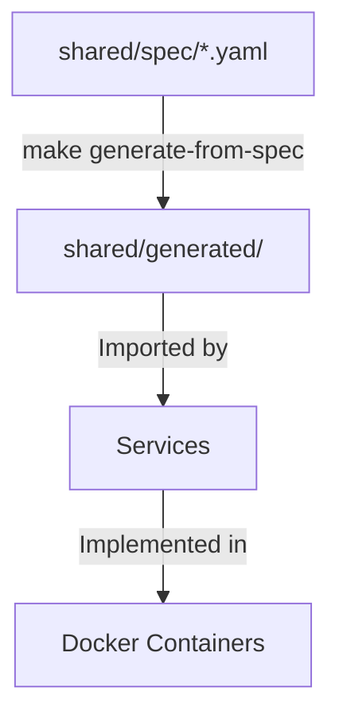

# Architecture & Design

This document describes how the principles in `MANIFESTO.md` are implemented technically.

## The "Spec-First" Flow

The heart of the framework is the `shared/spec/` directory. This is the single source of truth for the data model and API surface.

1.  **Define:** You edit `shared/spec/models.yaml` or `shared/spec/events.yaml`.
2.  **Generate:** Run `make generate-from-spec`. This produces Pydantic models and FastAPI router stubs in `shared/generated/`.
3.  **Implement:** Services import these generated assets. You only write the business logic to satisfy the interfaces.

## Service Modules

The project is a collection of modular services defined in `services.yml`.

- **Definition:** A service is simply an entry in `services.yml` with a `name`, `type`, and `description`.
- **Scaffolding:** The `make sync-services` command ensures that for every entry in `services.yml`, a corresponding directory exists in `services/` with the correct boilerplate.
- **Isolation:** Each service is its own Docker container. They communicate only via defined APIs or shared infrastructure (DB, Queue).

### Service Types

- `python-fastapi`: HTTP API service using FastAPI with uvicorn (exposes port 8000).
- `python-faststream`: Event-driven worker using FastStream (no HTTP, consumes from message broker).
- `default`: Generic container placeholder.

### Compose Options

Services can specify `depends_on` and `profiles` in `services.yml` to customize Docker Compose behavior.

## Containerization Strategy

**Rule:** Nothing runs on the host machine except `docker`, `make`, and `git`.

- **Tooling Container:** We use a dedicated `tooling` service in `docker-compose` to run administrative tasks (migrations, linting, scaffolding). This ensures all developers and agents use the exact same versions of tools.
- **Service Containers:** Each service has its own `Dockerfile` generated from a template.

## Directory Structure

- `infra/`: Docker Compose files and infrastructure config.
- `services/`: Source code for individual microservices.
- `backend/`: FastAPI REST API with PostgreSQL.
- `tg_bot/`: Telegram bot (FastStream worker).

- `shared/`:
    - `spec/`: YAML specifications (Source of Truth).
    - `generated/`: Auto-generated code (Do Not Edit).
- `templates/`: Jinja2 templates for scaffolding new services.

## Infrastructure Components

- **PostgreSQL:** Primary database for persistent storage.
- **Redis:** Message broker for async event processing.
- **Caddy:** Reverse proxy with automatic HTTPS.
